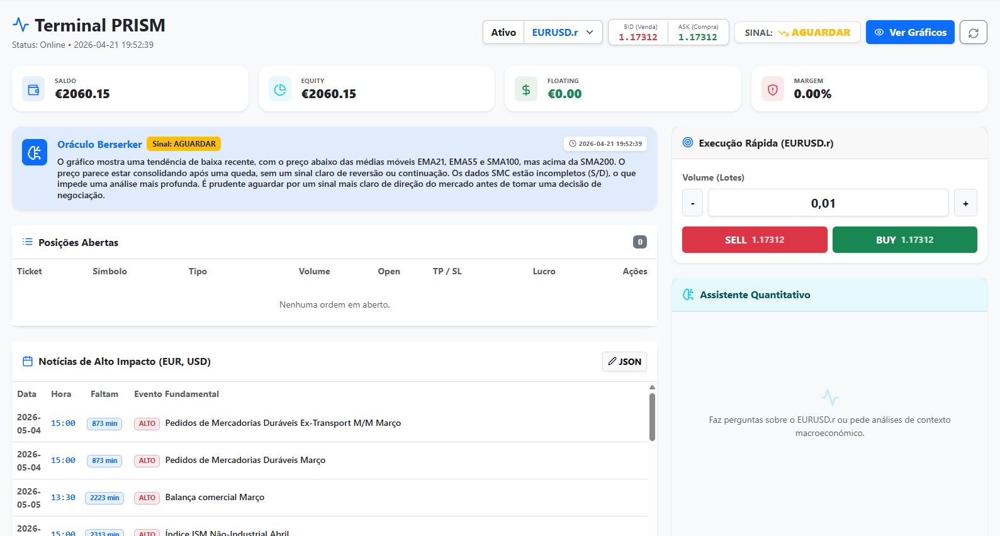
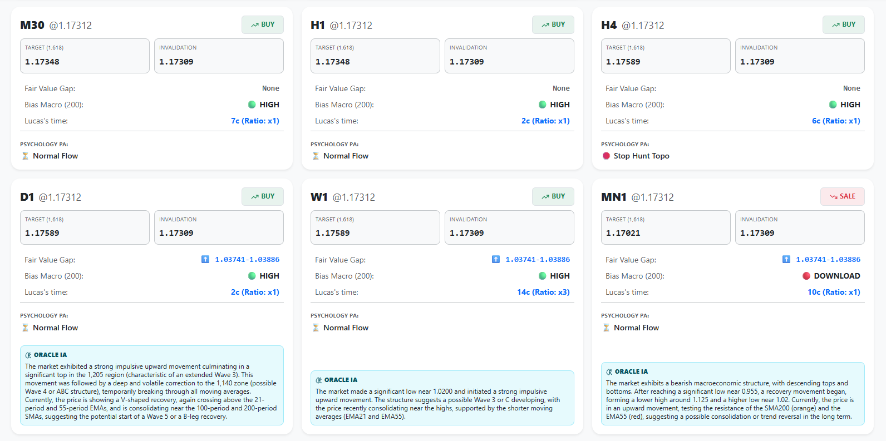
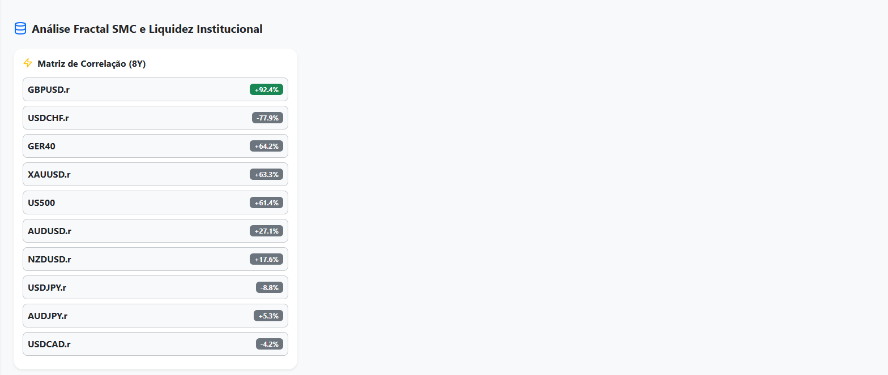

# Prism Quant: AI-Driven Algorithmic Trading & Analytics Platform



Prism Quant is a full-stack, institutional-grade quantitative trading platform. It bridges high-frequency MetaTrader 5 (MT5) execution with advanced LLM reasoning (Google Gemini 2.0 Flash) and Smart Money Concepts (SMC).

Designed for absolute autonomy, it features real-time Order Flow (DOM) heatmaps, Elliott Wave fractal analysis mapped with the Lucas Sequence, and direct low-latency order execution via a React-based remote dashboard.

## 🚀 Key Features

* **AI "Berserker" Oracle:** Integrates the Google Gemini API to parse complex macroeconomic data, correlate 8-year macro matrices, and generate real-time trade signals based on live chart images (Base64 encoded via MPLFinance).



* **Direct MT5 Execution Bridge:** FastAPI backend communicates directly with the MetaTrader 5 terminal (`FPMarkets`), allowing seamless order placement, TP/SL modification, and position tracking with microsecond latency.
* **Institutional Liquidity Tracking (DOM):** Real-time extraction and visualization of "Sell Walls" and "Buy Cushions" (Bid/Ask heatmaps) to identify institutional footprints.



* **Elliott Wave & Lucas Sequence Visualizer:** Custom React SVG engine that visually tracks market structures (Impulse/Retracement phases) and calculates incoming fractal pivots using the Lucas time-sequence.
* **Dynamic Risk Calculator:** Automated lot-sizing based on precise structural targets and 1:500 margin constraints.

## 🏗️ Prism Quant: System Architecture Diagram
```mermaid
graph TD
    subgraph "DATA SOURCE LAYER"
        MT5[MetaTrader 5 Terminal]
        FP[FPMarkets Liquidity Pool]
    end

    subgraph "INTELLIGENCE ENGINE (Matrix SMC)"
        A[MT5 Raw Data Pull] --> B{SMC & Macro Analytics}
        B -->|Lucas Sequence| C[Time Projections]
        B -->|Correlation 8Y| D[Market Matrix]
        B -->|mplfinance| E[Apex Vision Generation]
        E -->|Base64| G[Google Gemini 3.1 Pro]
        G -->|Visual Analysis| H[Institutional Bias]
    end

    subgraph "ATOMIC DATA BRIDGE"
        H --> JSON[(fibo_data.json)]
        D --> JSON
        C --> JSON
    end

    subgraph "EXECUTION ENGINE (Apex Berserker)"
        JSON --> I[Context Loading]
        I --> J{Multi-Strategy Logic}
        J -->|Signal Confirmation| K[Berserker Oracle LLM]
        J -->|M1 HFT Mode| L[Turtle Soup / Sweep Detection]
        K --> M[Risk & Money Management]
        L --> M
        M -->|TRADE_ACTION_DEAL| MT5
    end

    MT5 <--> FP
	
🛠️ System Architecture
Frontend (React / TypeScript): A sleek, dark-mode-ready dashboard providing real-time ticker data, advanced SVG charting, order management, and a dedicated UI for the Gemini-powered Financial Assistant.

Backend (FastAPI / Python): The high-performance core handling MT5 initialization, live chart rendering (mplfinance), algorithmic signal processing, and asynchronous API calls to Finnhub for macroeconomic events.

Execution Layer (MT5 C++ API): Python MT5 integration executing secure, deviation-controlled TRADE_ACTION_DEAL requests directly into the broker's liquidity pool.

💻 Tech Stack
Backend: Python 3.9+, FastAPI, Pandas, MPLFinance, MetaTrader5 API, Google GenAI.

Frontend: React, TypeScript, TailwindCSS/Bootstrap, Lucide-React, React-Markdown.

Infrastructure: Designed for Windows Server / VPS deployment (requires local MT5 terminal instance).

🔒 Setup & Installation
Note: This repository contains the core logic and interface. Proprietary JSON data feeds (fibo_data.json, elliott_memory.json) and API keys are not included for security reasons.

1. Clone the repository:
git clone [https://github.com/filipepinhocosta/prism-quant-platform.git](https://github.com/filipepinhocosta/prism-quant-platform.git)

2. Backend Setup:
cd backend
pip install -r requirements.txt
# Ensure MT5 is installed. The platform is configured to connect to:
# C:\Program Files\FPMarkets MT5 Terminal
uvicorn main:app --reload

3. Frontend Setup:
cd frontend
npm install
npm start

📝 License
This project is for educational and portfolio demonstration purposes. Trading in financial markets carries a high level of risk.